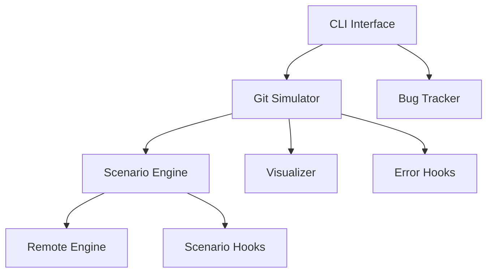

# 🤝 Contributing to GitBug

Thank you for your interest in contributing to GitBug! 🎉
We welcome contributions for new Git scenarios, command explanations, error handlers, visual improvements, and bug tracker enhancements.

<br>

## 🧭 Project Overview

GitBug is a CLI simulator that teaches Git through interactive bug scenarios. Key features:

* Simulated merge conflicts with visual Git state
* Step-by-step objectives and hints
* Custom explanations and error diagnostics
* Team-based bug tracking with real-world roles

<br>

## 🔍 Project Architecture



<br>

### 🔑 Key Components

| Folder/Module     | Purpose                                  |
| ----------------- | ---------------------------------------- |
| `git_simulation/` | Core Git simulation, hooks, visual state |
| `scenarios/`      | Scenario setup, checks, and flow         |
| `bug_simulator/`  | Bug tracker CLI and logic                |
| `explanations/`   | Markdown help for Git commands           |
| `utils/`          | Config, file ops, display tools          |
| `data/`           | Bugs, scenarios, users JSON storage      |

<br>

## 🚀 What Can You Contribute?

| Contribution Type   | Primary Files              | Secondary Files        |
| ------------------- | -------------------------- | ---------------------- |
| New Scenario        | `scenarios/*.py`           | `scenario_engine.py`   |
| Command Explanation | `explanations/*.md`        | `git_command_hooks.py` |
| Error Handler       | `git_error_hooks.py`       | `git_utils.py`         |
| Bug Tracker Feature | `bug_simulator/bug_ops.py` | `bug_cli.py`           |
| Visualization       | `visualizer.py`            | `graph_manager.py`     |

> 📖 Docs & Examples   Improve guides, gifs, screenshots                          
> 💡 Feature Ideas      Suggest and build new Git learning tools                   

<br>

## 🛠️ Local Setup

```bash
git clone https://github.com/dvig14/gitbug.git
cd gitbug
pip install rich  # Optional but recommended for visuals
python cli.py --help
```

<br>

## 🧩 Add a New Git Scenario

1. Create a file in `gitbugsim/scenarios/` (e.g., `rebase_mistake.py`)
2. Define:

   * A `setup_...()` function
   * One or more `check_...()` functions
3. Add metadata in `data/scenarios.json`
4. Register your scenario functions in `scenario_hook.py`
5. Use `python cli.py add` to create a bug linked to your scenario
6. Test it using `python cli.py simulate`

**Example**: See `merge_conflict.py`.

✅ Want to setup remote or simulate teammates? Use `RemoteEngine` for auto-pushed conflicts.

<br>

## 📚 Add Command Explanations

Let users type `explain <command>` to learn Git commands in context.

### To contribute:

1. Add a markdown file in: `gitbugsim/explanations/<cmd>/<topic>.md`
2. Style it with Rich tags like `[yellow]`, `[cyan]`, tables, etc.
3. Register it in `git_command_hooks.py` like:

```python
@git_explainer("rebase")
def explain_rebase():
    load_explanation("rebase/main", "rebase")
```

4. Run `explain rebase` in simulation to test.

<br>

## ⚠️ Add Git Error Explanations

Make Git's cryptic errors actionable.

1. Open `git_error_hooks.py`
2. Add:

```python
@git_error(["fatal: no upstream branch"], "push")
def error_push_no_upstream(stderr):
    display.panel("⛔ Push Error", f"""
Git error: {stderr}
"...solution and cause..."
""", border_style="red")
```

<br>

## 🧪 Testing Your Contributions

```bash
python cli.py add        # Create a bug with your scenario
python cli.py assign     # Assign the bug
python cli.py simulate   # Run the scenario
```

*(No automated unit tests yet, manual testing preferred)*

<br>

<details>
<summary>💡 Scenario Ideas You Can Build</summary>

<br>


| Scenario Name   | What It Teaches               |
| --------------- | ----------------------------- |
| Detached HEAD   | What HEAD is and how it moves |
| Reset vs Revert | How to undo changes safely    |
| Rebase Workflow | Rewriting history             |
| Cherry-Pick     | Copy commits between branches |
| Git Clean       | Clean untracked/ignored files |
| Stash & Reapply | Save dirty changes            |
| Reflog Recovery | Recover deleted commits       |

</details>

<br>

<details>
<summary>🪜 Good First Issues</summary>

<br>


| Task                                        | Description                                                                        |
| ------------------------------------------- | ---------------------------------------------------------------------------------- |
| ✅ `explain push`                            | Add explanation for the `push` command (markdown + hook in `git_command_hooks.py`) |
| 📁 `Untracked vs Staged vs Committed Files` | Create a beginner-friendly scenario to simulate Git file states                    |
| 🔁 `Dual-State File`                        | Build a scenario where a file is staged, then modified again before commit         |
| 📊 Improve Graph Visualizer                 | Enhance visuals shown during `merge`, `rebase`, or `reset`                         |
| ❗ Add Error Handlers                        | Add diagnostics for common errors (e.g., `pull --rebase` conflicts)                |

</details>

<br>

## 🔖 Suggested PR Labels

* `type:scenario`
* `type:docs`
* `type:visual`
* `type:error`
* `type:enhancement`

<br>

## 📚 Resources

* [`README.md`](./README.md) — Overview & usage
* [GitHub Issues](https://github.com/dvig14/gitbug/issues) — Report bugs or ideas

<br>

## 🙌 Thank You!

We’re thrilled to have your help building a better Git learning experience.
Let’s make Git less scary — one merge conflict at a time! 💥


