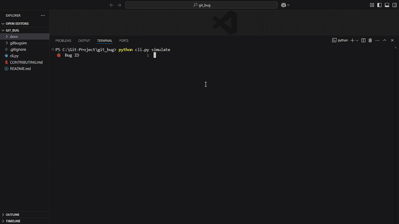
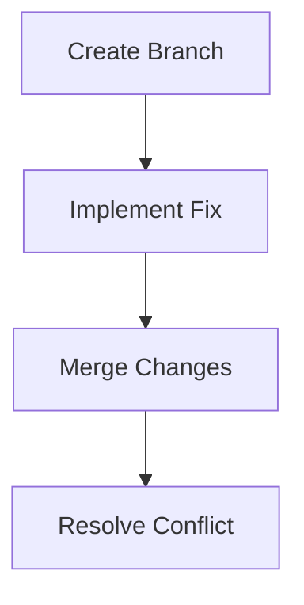

# GitBug: Git Learning Simulator


<br><br>


**GitBug** is an CLI that teaches Git through hands-on bug fixing. Experience a realistic merge conflict scenario with visual feedback at every step - the first of many Git challenges to come!
It helps you learn by doing, not just reading.

> "Finally understand merge conflicts through practical experience!" - Early Tester

<br>

## 🚀 Features

* 🔀 **Merge Conflict Scenario**: A full guided simulation of a real-world Git merge conflict with step-by-step objectives
* 📊 **Visual Git Internals**: Track the working directory, staging area, and commit history visually
* 🐞 **Bug Tracker**: Simulate software bugs with role-based reporting, assigning, and tracking
* 💡 **Command Insights**: Use `explain <command>` to understand how Git works
* 👥 **Auto Team Setup (in Scenarios)**: Simulated teammates automatically push conflicting changes during scenario setups (not user-driven)
* 🌐 **Remote Repo Simulation**: Used only in scenario-based bugs for merge/rebase cases; normal bugs run in simple local-only Git repos
* 🌟 **Error Diagnosis**: Get helpful feedback and suggestions when you run into mistakes
* 🔍 **Graph Before/After View**: Visualize Git state transitions before and after critical commands like `merge`, `reset`, and `rebase`
* 🔹 **Command Hooks**: Contribute new explanations or behaviors for Git commands

<br>

## 🎮 Demo of Merge Conflict with state visual and graph transitions

|  Scenario Start             |  Git State Visualization | Graph Transitions              |
| --------------------------  | ------------------------ | ------------------------------ |
|  |  |  |

<br>

## 📆 Installation

```bash
git clone https://github.com/dvig14/gitbug.git
cd gitbug
```

> 💡 For best visuals, install `rich` *(Recommended)*:
> `pip install rich`

<br>

## 🧪 Quickstart

```bash
python cli.py add        # Report a new bug
python cli.py assign     # Assign a bug
python cli.py list       # View bugs
python cli.py simulate   # Start Git simulation
```

Follow the in-terminal prompts to solve the scenario.

<br>

## 🪩 Merge Conflict Walkthrough



You’ll:

* Create a feature branch
* Fix a bug in `login.css`
* Simulated a teammate conflict
* Resolve and commit

<br>

## 🖼️ Visual Git State (Implemented)

See Git's internal state evolve in real-time - unique to GitBug!

**Initial State:**
```bash
📊 Git State Visualization
─────────────────────────────────────────────────────────────────────────
📁 Working Directory     📥 Staging Area      🗃 Commit History
─────────────────────────────────────────────────────────────────────────
• login.css (modified)    • (empty)            ✔️ a1b2c: Initial commit
• (no other changes)                           ✔️ d4e5f: Add header
─────────────────────────────────────────────────────────────────────────
```

**After `git add login.css`:**
```bash
📊 Git State Visualization
───────────────────────────────────────────────────────────────────────
📁 Working Directory     📥 Staging Area      🗃 Commit History
───────────────────────────────────────────────────────────────────────
• (no changes)           • login.css          ✔️ a1b2c: Initial commit
                                              ✔️ d4e5f: Add header
───────────────────────────────────────────────────────────────────────
```

<br>

## 🏗️ Project Structure (Current Implementation)

```
cli.py                       # Main entry point
CONTRIBUTING.md              # How to contribute
README.md                    # Overview
gifs/                        # scenario start, state, graph

gitbugsim/
├── bug_simulator/           # Bug tracker (add, assign, list)
├── data/                    # JSON data: bugs, scenarios, users
├── explanations/            # Markdown help for commands
├── git_simulation/          # Git simulator + visualizer + hooks
├── scenarios/               # Scenario engine, remote engine & logic
└── utils/                   # Common helpers
```

<br>

## 🧠 Roadmap

### ✅ Phase 1 (Complete)

* Merge Conflict Scenario
* Bug Tracker System
* Role-based CLI (reporter, developer, manager)
* Visual Git State

### 🧲 Phase 2 (Planned)

* Detached HEAD recovery
* Reset vs Revert
* Stashing changes
* Rebase workflow (interactive, squash)

### 🔄 Phase 3 (Team Flow)

* Pull request simulations
* Teammate reviews
* Remote push/pull scenarios

<br>

## 👍 Contributing

We’re looking for:

* Scenario creators (e.g., `rebase`, `stash`, `reset`, `revert`)
* Contributors to `explain <command>` logic, `add more git errors`
* Developers who can enhance visuals
* Writers to document usage, command flow, and help messages

See [CONTRIBUTING.md](CONTRIBUTING.md) to get started!

<br>

## 📜 License

GitBug is licensed under the **[MIT License](LICENSE)** - free to use, learn, and extend.

<br>

## 🙏 Thanks

* [rich](https://github.com/Textualize/rich) — for beautiful CLI rendering
* All contributors — join the mission to make Git learning fun and real!

**Join us in building the future of Git education!**
